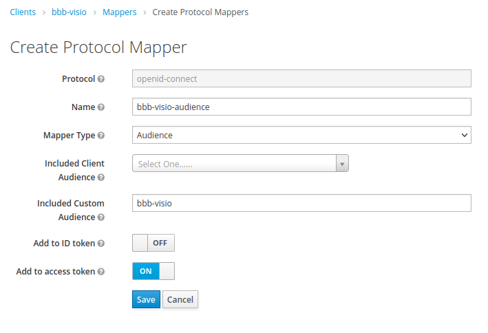

# API publique

## Points d'accès

Une API publique est disponible sur `/api/meetings` et `/api/shadow-meeting`. Cette API est utilisée par les greffons Thunderbird et Outlook.

Les réponses sont au format json sous la forme suivante :

```json
{
  "meetings": [
    {
      "attendee_url": "https://example.tld/meeting/signin/invite/1234/creator/5678/hash/27955e8c3a16ecadbb3cf61df7806a04ce6fd18c",
      "moderator_url": "https://example.tld/meeting/signin/moderateur/1234/creator/5678/hash/3e73643801d5013d389f8fc610e258aba38e597d",
      "name": "Mon Séminaire"
    }
  ]
}
```

### Liste des meetings
`/api/meetings`
L'API renvoie la liste des meetings de l'utilisateurs.

### Meeting 'silencieux'
`/api/shadow-meeting`
Chaque utilisateur possède un meeting 'silencieux' invisible dans l'interface b3desk, mais utilisable par des greffons.
L'API renvoie les liens d'invitation du meeting silencieux.

Voici les principales valeur par défaut d'un meeting 'silencieux' :
+ name= <wording_meeting> de <user_name>"
+ welcome= Bienvenue dans <wording_the_meeting> de <user_name>"
+ duration= <default_shadow_meeting_duration> (200 par défaut)
+ maxParticipants= 350
+ logoutUrl= <settings_meeting_logout_url>
+ moderatorOnlyMessage= Bienvenue aux modérateurs
+ record= False
+ autoStartRecording= False
+ allowStartStopRecording= False
+ lockSettingsDisableMic= False
+ lockSettingsDisablePrivateChat= False
+ lockSettingsDisablePublicChat= False
+ lockSettingsDisableNote= False
+ lockSettingsDisableCam= False
+ allowModsToUnmuteUsers= False
+ webcamsOnlyForModerator= False
+ muteOnStart= True
+ guestPolicy= False
+ logo= None


## Authentification

L'authentification à l'API se fait en passant un jeton OIDC émis par le serveur d'identifié configuré dans `OIDC_ISSUER`.

### Tests

On peut tester le bon fonctionnement de l'API comme ceci (*en renseignant au préalable la variable `$TOKEN`*).

```bash
curl -s -H "Authorization:Bearer $TOKEN" https://example.tld/api/meetings
```

### Problèmes de connexion

#### Jeton manquant

Lorsque le jeton d'identification n'a pas été fourni dans la requête, l'API retourne des codes d'erreur HTTP 401.

#### Jeton expiré

Lorsque le jeton est expiré, l'API retourne des codes d'erreur HTTP 403.

#### Mauvaise audience du jeton

Lorsque l'audience du jeton est incorrecte, l'API retourne des codes d'erreur 403.
Dans les faits il faut s'assurer que le paramètre `aud` du jeton contient bien l'ID client OIDC de l'application, définie dans le paramètre `OIDC_CLIENT_ID` de l'application, et prenant par défaut la valeur `bbb-vision`.
On peut vérifier l'audience d'un token avec des outils tels que [jwt.io](https://jwt.io).

Par défaut, keycloak ne remplit pas l'audience du jeton avec l'ID client.
Il est nécessaire d'effectuer une configuration dans la console d'aministration de keycloak comme celle-ci (c'est un exemple, d'autres sont probablement possibles) :

1. Se rendre sur la console d'administration de keycloak
2. Se rendre dans le menu « Clients »
3. Sélectionner le client « bbb-visio »
4. Se rendre dans l'onglet « Mappers »
5. Cliquer sur le bouton « Create »
6. Remplir (par exemple) le formulaire comme ceci:
   - Name: bbb-visio-audience
   - Mapper Type: audience
   - Included Custom Audience: bbb-visio

   
7. Générer un nouveau token et vérifier qu'il contient bien la valeur `bbb-vision` dans le paramètre `aud`.
