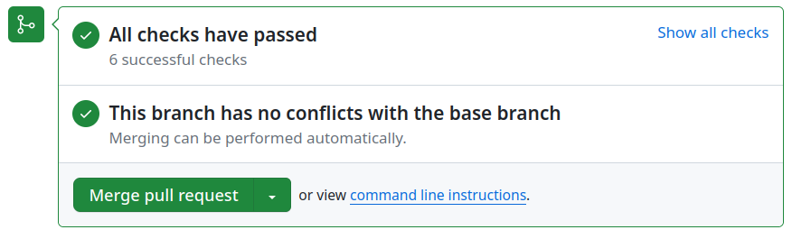

# Intégration Continue

Quand l’intégration continue (CI) s’est correctement déroulée, l’interface de github affiche cet encart :

Les différentes étapes de l’intégration continue

## CI : Tests dans un virtualenv

GitHub Actions fait passer la suite de test sur un virtualenv.

Pour passer cette étape, il faut que `pytest` soit vert sur votre environnement local.

## CI : Tests dans un conteneur

GitHub Actions fait passer la suite de test dans un conteneur Docker.

Pour passer cette étape, il faut que la commande `docker-compose run --rm tests` soit verte sur votre machine.

## CI : Healthcheck sur les conteneurs

GitHub Actions lance tous les conteneurs requis pour un environnement de développement local et fait un healthcheck sur chacun. Certains vont vérifier que le service fonctionne, d'autres on besoin de valider que les ocnteneurs peuvent communiquer entre eux.

Cela permet d'assurer que le code reste fonctionnel lorsqu'on lance le projet de zéro sur une nouvelle machine, et qu'il est donc possible d'embarquer de nouvelles·aux contributeur·rice·s.

## CI : Couverture de code croissante

GitHub Actions va vérifier que la couverture de test de la pull request est au moins égale à celle du dernier commit.

Cela permet d'augmenter au fur et à mesure ce que les tests vont couvrir et donc d'assurer de plus en plus l'état fonctionnel du projet.

Pour être sûr de passer cette étape, il suffit d'ajouter des tests **au moins** sur le code que vous modifiez.

## CI : Formattage du code

GitHub Actions va vérifier que le code a bien été formatté. Pour le moment, seul `black` est exécuté, mais à l'avenir, `flake8` ou encore `mypy` pourraient être requis. Le même genre de décisions pourait être appliquée au front.
