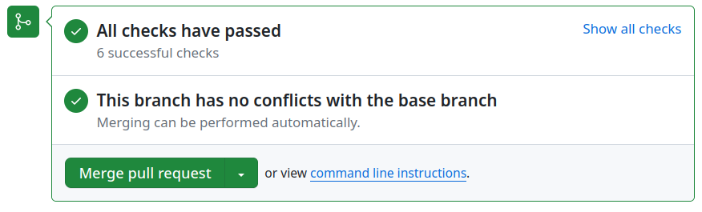

# Revue de code

Deux branches principales sont utilisées :

- `main` est la branche de développement. Elle sert à recevoir les PR de fonctionnalités et les corrections de bugs importantes.
- `production` est la branche stable. Elle sert à recevoir les hotfixes.

Le *périmètre technique* est la responsabilité de l’équipe de développement.
Elle est donc autonome pour valider les modifications de code touchant à la qualité, aux réusinages etc.

Le *périmètre fonctionnel* est la responsabilité de l’équipe produit.
C’est donc à elle de valider les modifications touchant aux fonctionnalités, et certaines corrections, en suivant le processus suivant.

## 1. S’assurer que la CI est bien verte

Quand l’intégration continue (CI) s’est correctement déroulée, l’interface de github affiche cet encart :



Ne pas valider un PR qui ne passerait pas la batterie de tests automatiques de la CI.
Plus de détails sur l’intégration continue sont disponibles dans la {ref}`section dédiée <developers/ci:Intégration Continue>`.

## 2. Déployer la PR dans un environnement de test

Passées ces étapes, les mainteneurs font une validation manuelle des développements réalisés.

Sur un serveur de préprod, il faut récupérer la *pull request* en question.
Exécuter les commandes suivantes en remplaçant `<ID>` par le numéro de la PR.
```bash
# Récupération de la PR
git fetch origin pull/<ID>/head:pr<ID>

# Changement vers la branche de la PR
git switch pr<ID>

# Démarrage des services
docker compose -f docker-compose.yml -f docker-compose.preprod.yml up
```

## 3. Tests fonctionnels

Sur l’instance de test, vérifier que les corrections ou fonctionnalités correspondent aux attentes, et ne créent pas d’effets de bord indésirables.

S’il y a des choses à améliorer, commenter dans le fil de discussion de la PR sur github, puis reprendre à l’étape 1 lorsque des corrections sont appportées.
Il suffira d’effectuer un `git pull origin pr<ID>` pour mettre le code à jour.

## 4. Fusionner.

Enfin, lorsque tout semble bon, fusionner la Pull Request sur Github.
