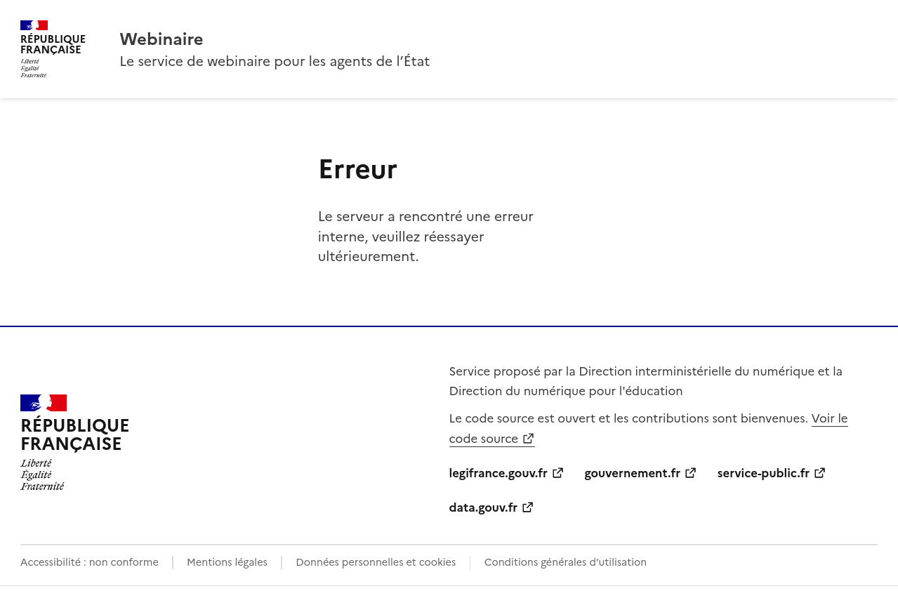
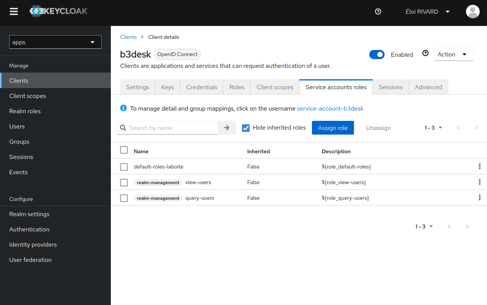

Configuration
#############

B3Desk
======

L’ensemble des paramètres décrits sur cette page peuvent être passées en variables d’environnement à l’application B3Desk.

.. autopydantic_model:: b3desk.settings.MainSettings

Nginx
=====

B3Desk fournit des pages d'erreurs statiques qui peuvent être affichées en cas de problème.
Pour utiliser ces pages statiques, on peut utiliser le paramètre `error_page <https://nginx.org/en/docs/http/ngx_http_core_module.html#error_page>`_ de Nginx::

    error_page 500 502 503 504 /static/errors/custom_50x.html;

Avec cette configuration, dès que le service est indisponible, Nginx servira cette page d'erreur:

Jumelage avec Apps
==================

Configuration de B3Desk
-----------------------

Afin que les utilisateurs de b3desk puissent accéder à leurs fichiers Nextcloud d’Apps, il faut que l’application puisse récupérer l’identifiant attendu par Nextcloud. Pour ce faire une requête est faite sur l’`API Users de Keycloak <https://www.keycloak.org/docs-api/22.0.1/rest-api/index.html#_users>`_.

Il est donc nécessaire de configurer les paramètres de configuration suivants :

- :attr:`~b3desk.settings.MainSettings.SECONDARY_IDENTITY_PROVIDER_ENABLED`
- :attr:`~b3desk.settings.MainSettings.SECONDARY_IDENTITY_PROVIDER_URI`
- :attr:`~b3desk.settings.MainSettings.SECONDARY_IDENTITY_PROVIDER_REALM`
- :attr:`~b3desk.settings.MainSettings.SECONDARY_IDENTITY_PROVIDER_CLIENT_ID`
- :attr:`~b3desk.settings.MainSettings.SECONDARY_IDENTITY_PROVIDER_CLIENT_SECRET`

On peut ensuite tester que la configuration est correcte grâce à la commande suivante :

.. code-block:: bash

   docker exec -it <CONTAINER_ID/NAME> flask get-apps-id <email@example.com>

En remplaçant ``<CONTAINER_ID/NAME>`` par l’identifiant du conteneur `b3desk_web` ou simplement son nom, et ``<email@example.com>`` par l’email d’un utilisateur, cette commande tente une connexion à l’API keycloak d’apps, afin de récupérer l’identifiant dont l’email a été passé en paramètre.

Si la connexion à l’API de keycloak échoue, cette commande indiquera à quelle étape, et quelles sont les pistes de résolution.

Configuration de Keycloak
-------------------------

Pour que la connexion de B3Desk à Apps fonctionne correctement, il est nécessaire que keycloak autorise les connexion par `identifiants client <https://datatracker.ietf.org/doc/html/rfc6749#section-4.4>`_.

Vérifier que la configuration de Keycloak est correcte
^^^^^^^^^^^^^^^^^^^^^^^^^^^^^^^^^^^^^^^^^^^^^^^^^^^^^^

- Se rendre la console d’administration Keycloak, dans le `realm` ``apps``.
  Par exemple https://auth.eole3.dev/auth/admin/master/console/#/apps
- Se rendre dans la section « Clients » et sélectionner « b3desk »
- Sélectionner l’onglet « Service account roles »
- À cet endroit on doit voir deux lignes avec les droits ``real-management view-users`` et ``realm-management query-users``.

Configuration de Keycloak est correcte
^^^^^^^^^^^^^^^^^^^^^^^^^^^^^^^^^^^^^^

Si les droits ``real-management view-users`` et ``realm-management query-users`` ne sont pas présents, il faut les ajouter :

- Cliquer sur le bouton « Assign roles », une fenêtre modale doit s’ouvrir
- Cliquer sur le menu déroulant des filtres en haut à gauche, et sélectionner « Filter by clients » plutôt que « Filter by realm roles »
- Dans le champ de recherche, entrer « users » et valider
- Cocher « view-users » et « query-users » puis sur le bouton « Assign »

Utilisation d'un méteriel visio SIPMediaGW
==========================================

Configuration de B3Desk
-----------------------

Afin de permettre au matériel visio SIPMediaGW de rejoindre une visio via B3Desk, il faut lui communiquer un token qui sécurisera la connexion à B3Desk.

Dans un premier temps, il faut générer une clé privée :

.. code-block:: bash

   docker exec -it <CONTAINER_ID/NAME> flask generate-private-key

En remplaçant ``<CONTAINER_ID/NAME>`` par l’identifiant du conteneur b3desk_web ou simplement son nom, cette commande va générer une clé privée qui sera affectée à l'instance B3Desk.
Afin de permettre que les tokens générés avec cette clé privée soient reconnus par tous les serveurs, il convient d'utiliser la même clé privée sur tous les serveurs d'une même instance B3Desk.

On peut ensuite configurer les paramètres suivants de manière identique pour tous les serveurs d'une même instance B3Desk :

- :attr:`~b3desk.settings.MainSettings.ENABLE_SIP`
- :attr:`~b3desk.settings.MainSettings.FQDN_SIP_SERVER`
- :attr:`~b3desk.settings.MainSettings.PRIVATE_KEY`

Il est maintenant nécessaire de redémarrer le conteneur de chaque serveur :

.. code-block:: bash

   docker compose -f docker-compose.yml -f docker-compose.prod.yml web -d

Il est possible de vérfier que le paramétrage a été correctement effectué :

.. code-block:: bash

   docker exec -it <CONTAINER_ID/NAME> flask check-sip-setttings

Générer un sip-token
--------------------

Une fois que B3Desk est correctement paramétré, la généreration de sip-token est active :

.. code-block:: bash

   docker exec -it <CONTAINER_ID/NAME> flask generate-sip-token

Ce token est valide sans limite de temps, tant que la clé privée reste la même. Un même token pourra servir pour plusieurs services différents de visio SIPMediaGW tant qu'ils requêtent la même instance possèdant la bonne clé privée.

Vous pouvez vérifier que le token est valide avec la commande :

.. code-block:: bash

   docker exec -it <CONTAINER_ID/NAME> flask check-sip-token "<token>"

Il suffira de transmettre ce token au matériel SIP qui devra le joindre dans le header ``{"Authorization": <token>}`` lors de ses requêtes sur la route suivante : ``https://<instance_b3desk>/sip-connect/<visio_code>``
